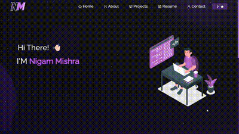

<h1 align="center">👋 Hello, Developers! I'm Nigam</h1>
<h3 align="center">A passionate frontend developer from Odisha</h3>

###

- 🔭 I’m currently working on [tourism-management-system](https://nigammishra.github.io/tourism-management-system/)

- 🌱 I’m currently learning **ReactJS, NodeJS , MongoDB (MERN Stack)**

- 👯 I’m looking to collaborate on [contact-book-react,library-mgmt-react](https://frex-arup.github.io/library-mgmt-react/)

- 👨‍💻 All of my projects are available at [https://nigammishra.github.io/nigam-portfolio/](https://nigammishra.github.io/nigam-portfolio/)

- 📫 How to reach me **nigammishra826@gmail.com**

<h3 align="left">Connect with me:</h3>

<h3 align="left">Languages and Tools:</h3>

                     

  
  
  

###

<!-- 

  
  
  
  
  
  
  
  
  
  
  
  
  
  
  
  
  
  
     
  

 -->

###

###

 
  
  

###

 

###
